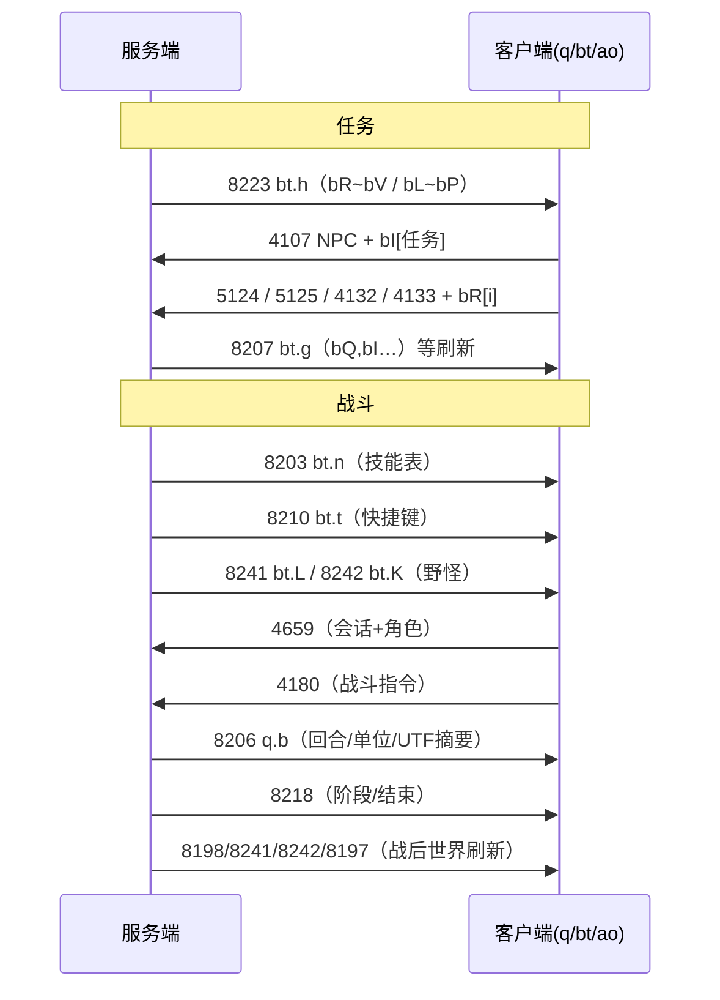

# 任务与战斗系统设计分析

本文基于 `log/任务&&战斗日志.out` 的抓包顺序与 `jadx/sources/defpackage` 中 `q.java`、`bt.java`、`bz.java`、`ao.java` 的反编译逻辑，说明**任务系统**与**战斗系统**的客户端数据模型、界面状态机及**网络包交互**。

---

## 一、日志场景概览（`任务&&战斗日志.out`）

1. **登录与进图**：`6400` 登录 → `8194/8195` 会话与角色列表 → `4250` 选角 → `8192` 批量包内下发 `8260` 地图资源、`8245` 分块压缩数据、`8199` 空间通道与目标图、`8198` 地图实体、`8200` 点集等（与 `docs/网络包协议分析.md` 一致）。
2. **角色与养成数据**：`8197` 角色完整状态、`8209` 物品/装备条目、`8203` 技能定义（名称、描述、升级需求等）、`8210` 战斗快捷键槽位绑定（如「普通攻击」+ 药品）。
3. **任务与野怪**：`8223` 下发多条任务文案（如「叛乱物资5」「消灭10只野怪(主)」）；`8241` 下发当前地图野怪类型（草精/树精/猴子）及等级区间；`8242` 下发野怪在地图上的实例/站位关系（多组 short 编码）。
4. **进入战斗后的交互**：客户端发送 `4659`（`0x1233`）、`4180`（`0x1054`）等；服务端多次下发 `8206` 同步战斗回合与单位状态；`8218` 标记战斗阶段变化；战斗结束后再次出现 `8198/8241/8242/8197` 等世界刷新包。

以下各节按**任务**与**战斗**拆开，对应到具体类与包 ID。

---

## 二、任务系统设计

### 2.1 服务端驱动的任务列表模型（收包 `8223` → `bt.h`）

收包入口：`q.java` 在 `case 8223` 中调用 `bt.h(DataInputStream)`（非 PC 模拟器环境下还会关闭流，逻辑以 `ao.i()` 为分支）。

`bt.h` 将任务数据拆成**两组**并行数组（先「已接/主列表」，再「另一组扩展列表」）：

```1445:1507:jadx/sources/defpackage/bt.java
    public static void h(DataInputStream dataInputStream) throws IOException {
        int i2 = dataInputStream.readShort();
        if (i2 > 0) {
            bR = new int[i2];
            bS = new String[i2];
            bT = new short[i2];
            bU = new byte[i2];
            bV = new String[i2];
            for (int i3 = 0; i3 < i2; i3++) {
                bR[i3] = dataInputStream.readInt();
                bS[i3] = dataInputStream.readUTF();
                bT[i3] = dataInputStream.readShort();
                bU[i3] = dataInputStream.readByte();
                bV[i3] = dataInputStream.readUTF();
            }
        } else {
            // ... 清空 bR~bV ...
        }
        int i6 = dataInputStream.readShort();
        if (i6 > 0) {
            bL = new int[i6];
            bM = new String[i6];
            bN = new short[i6];
            bO = new int[i6];
            bP = new String[i6];
            for (int i7 = 0; i7 < i6; i7++) {
                bL[i7] = dataInputStream.readInt();
                bM[i7] = dataInputStream.readUTF();
                bN[i7] = dataInputStream.readShort();
                bO[i7] = dataInputStream.readInt();
                bP[i7] = dataInputStream.readUTF();
            }
            return;
        }
        // ... 清空 bL~bP ...
    }
```

**字段含义（结合日志 UTF 与 UI 使用方式推断）**：

| 全局字段 | 类型 | 作用 |
|---------|------|------|
| `bR` | int[] | 任务唯一 ID（与发包 `5124/5125/4132/4133` 关联） |
| `bS` | String[] | 任务名称 |
| `bT` | short[] | 需求等级或排序用等级显示（界面拼「×级」） |
| `bU` | byte[] | 任务状态枚举（与 `t.java` 中「未接受/未完成/完成」等展示一致） |
| `bV` | String[] | 详情/目标描述（日志中如「目标：消灭5只树精，5只草精」） |
| `bL`~`bP` | 同上结构 | 第二套任务线（活动/剧情等 Tab 数据源，`bO` 为 int 扩展字段） |

日志中 `8223` 解析出的字符串与上述 `readUTF` 顺序一致，例如：任务名「叛乱物资5」、进度描述「带一个铜锭给卢承庆」、主目标「消灭10只野怪(主)」等。

### 2.2 NPC 对话与任务 ID 上行（发包 `4107`）

玩家在地图上对 NPC 打开菜单并选择任务相关项时，`ao.java` 用当前 NPC 实例 id（`bt.t[this.af].a`）与任务 id 数组 `bt.bI[this.ai]` 组包：

```3722:3731:jadx/sources/defpackage/ao.java
                                            } else if (bt.bI != null && this.ai < bt.bI.length) {
                                                byte[] bArrA = bz.a((short) 4107, bt.ad, (int) bt.t[this.af].a, bt.bI[this.ai]);
                                                if (bArrA == null) {
                                                    this.e.b("获取上传指令数据错误!");
                                                    break;
                                                } else {
                                                    a.i.a(new w((short) 4107, bArrA));
                                                    this.e.a((String) null);
                                                    break;
                                                }
                                            }
```

说明：**具体接取/交付逻辑在服务端**；客户端只负责把「哪个 NPC + 哪个任务 ID」发到 `4107`（`0x100B`）。

### 2.3 任务界面状态与「已接」列表（`ao.x` / `I`）

打开任务面板时 `ao.x()` 将界面切到任务模式（`k`/`j` 状态、`aq` 标题「任务」、分页「已接/剧情/活动…」），列表数据来自 `bt.bS`、`bt.bT`、`bt.bV`：

```7693:7734:jadx/sources/defpackage/ao.java
    public final void x() {
        this.l = (short) 0;
        this.e.aq.b();
        this.e.aq.a("任务");
        // ...
        I(0);
        // ...
        if (bt.bV != null && bt.bV.length > 0) {
            this.e.ar.a(bt.bV[0], 1);
        }
        // ...
    }

    private void I(int i2) {
        this.cd = null;
        this.ce = null;
        this.cf = null;
        if (i2 == 0) {
            if (bt.bS == null) {
                this.cd = new String[1];
                this.cd[0] = "没有已经接任务";
                return;
            }
            this.cd = bt.bS;
            short[] sArr = bt.bT;
            this.ce = new String[sArr.length];
            for (int i3 = 0; i3 < sArr.length; i3++) {
                this.ce[i3] = new StringBuffer().append((int) sArr[i3]).append("级").toString();
            }
            this.cf = bt.bV;
            return;
        }
        // ... i2!=0 时切换 bM 等其它 Tab ...
    }
```

`q.java` 在 `case 8223` 中若当前已在任务界面（`a.e.k == 6`）且 `bR/bL` 非空会调用 `a.e.x()` 刷新列表。

### 2.4 任务确认/取消类上行（`5124` / `5125` / `4132` / `4133`）

在任务二级确认框中，根据 `ca.o` 分支发送不同包（任务 ID 一律取 `bt.bR[当前选中下标]`）：

```7825:7860:jadx/sources/defpackage/ao.java
        if (this.l == 1) {
            ca.b(i2);
            if (i2 == 268435456 || i2 == 517 || i2 == 1073741824) {
                switch (ca.o) {
                    case 0:
                        a((short) 5124, bz.a((short) 5124, bt.ad, bt.bR[this.e.ar.g()]), (String) null);
                        break;
                    case 1:
                        this.bs = (short) 0;
                        a((short) 5125, bz.a((short) 5125, bt.ad, bt.bR[this.e.ar.g()]), (String) null);
                        this.l = (short) 0;
                        break;
                    case 2:
                        a((short) 4132, bz.d((short) 4132, bt.ad, bt.bR[this.e.ar.g()]), (String) null);
                        // ...
                        break;
                }
            }
            // ...
        } else {
            if (this.l == 2) {
                // ...
                        a((short) 4133, bz.e((short) 4133, bt.ad, bt.bR[this.e.ar.g()]), (String) null);
```

**设计要点**：任务状态迁移（接受、放弃、某种中间确认）由**多个不同包 ID** 表达，客户端不计算结果，只发 `bR[i]`；刷新仍依赖后续 `8223` 或相关收包。

### 2.5 与 `8207` 的关系（`bt.g` 任务追踪串 + `bI` 列表）

`8207` 在非战斗且非 `ao.i()` 特殊分支时调用 `bt.g(DataInputStream)`，解析 `bQ`（任务追踪总述）及 `bI/bJ/nI/bK` 等（见 `bt.java` 约 1413～1429 行）。该组数据与 NPC 菜单里的 `bt.bI[this.ai]` 配合，形成「世界任务列表 + NPC 可交互任务 id」两层结构。

### 2.6 任务与战斗的互斥提示

`q.java` 中多处判断 `ao.i()`（是否 PC 模拟器）及「战斗中」：`8223` 打开任务列表时若 `bt.bR`、`bt.bL` 均为空则提示「当前没有任务」；普通菜单在战斗中会提示「战斗中不能进行该操作」等（见 `q.java` 约 449、481、638 行等）。

---

## 三、战斗系统设计

### 3.1 战前数据：技能（`8203`）与快捷键（`8210`）

- **`8203`**：`q` → `readByte()` 后 `bt.n(DataInputStream)`，填充技能静态表 `dv`～`dC`（技能 id、名称、类型、消耗、等级、描述等）。日志中可见「普通攻击」「宠物捕捉」「剧毒龙炎」等 UTF 串即来源于此循环 `readUTF`。
- **`8210`**：`bt.t(DataInputStream)` 读快捷键槽位数，为每槽写入类型/目标/物品栏位及关联技能名 `eo[]` 等；日志中「首回合捆装药」「普通攻击」「小捆金疮药」等与 `8210` 的 UTF 一致。

进入战斗后 UI 依赖 `bt.oo`～`eo` 与 `8206` 动态刷新。

### 3.2 野怪与地图战斗对象（`8241` / `8242`）

- **`8241`**：`bt.L` —— 按数量读每种野怪的 `readShort` 类型 id、`readUTF` 名称、多组 `int/short/byte` 属性（气血上下限、攻防等），用于名称盘与属性展示。
- **`8242`**：`bt.K` —— 在地图格网上布置野怪实例（`readInt` 实体 id、格子坐标 `*16`、巡逻/关联 short 数组 `hc[][]` 等），供遇敌与 `4180` 目标选择使用。

日志中战斗前后多次重复 `8241/8242`，说明**每次战斗结束或地图刷新**服务端会重同步野外单位。

### 3.3 战斗回合同步（收包 `8206` → `q.b`）

`case 8206` 调用私有静态方法 `b(DataInputStream)`，核心是：

1. `readLong` → 与 `bt.v`、`bq.g` 协同识别**当前战斗会话 id**（日志中可见非零 long，如 `0x8EF8` 一类）。
2. `readShort` 得回合或阶段数量 `i`，对每个阶段：
   - 读 `short` 条数，构造 `i[]`（类 `i`）：每条含多个 `byte` + `short` + `readUTF`（**战斗播报/技能名字符串**）。
   - 再读 `ae[]`：单位位置、阵营、`readInt` 多组血量/内力等战斗数值。
   - 再 `readUTF`（日志里合并了任务进度如「经验 :10」「任务：消灭10只野怪(主)」「草精：3/4」——说明服务端把**任务进度摘要**挂在战斗同步包末尾字符串里）。
3. 若当前界面模式为战斗相关（`a.e.k == 25 || 18 || !ao.i()`），将 `a.e.g.f` 置为 `1` 驱动 UI 刷新。

解析代码见：

```2255:2309:jadx/sources/defpackage/q.java
    private static void b(DataInputStream dataInputStream) throws IOException {
        long j = dataInputStream.readLong();
        if (bq.g > 0 && bt.v <= 0) {
            bt.v = j;
            bq.g = -1;
        }
        int i = dataInputStream.readShort();
        if (i > 0) {
            for (int i2 = 0; i2 < i; i2++) {
                int i3 = dataInputStream.readShort();
                if (i3 > 0) {
                    i[] iVarArr = new i[i3];
                    // ... new i() readByte/readUTF ...
                    a.e.g.a(iVarArr);
                }
            }
            for (int i5 = 0; i5 < i; i5++) {
                int i6 = dataInputStream.readShort();
                if (i6 > 0) {
                    ae[] aeVarArr = new ae[i6];
                    // ... 读单位战斗属性 ...
                    a.e.g.a(aeVarArr);
                }
            }
            for (int i8 = 0; i8 < i; i8++) {
                a.e.g.a(dataInputStream.readUTF());
            }
            if (a.e.k == 25 || a.e.k == 18 || !ao.i()) {
                a.e.g.f = (short) 1;
            }
        }
    }
```

**设计要点**：战斗表现层（立绘、血条、飘字）完全由服务端下发的 `i`/`ae`/UTF 驱动；**击杀计数与任务进度**由服务端在 UTF 摘要中增量告知客户端展示。

### 3.4 战斗阶段控制（收包 `8218`）

```518:546:jadx/sources/defpackage/q.java
                    case 8218:
                        long j = this.b.readLong();
                        byte b3 = this.b.readByte();
                        if (j == -1) {
                            if (a.e.g != null) {
                                bt.v = -1L;
                                bt.x = (short) -1;
                                a.e.g.l();
                            }
                        } else if (bq.g > 0 || j == bt.v) {
                            if (b3 == 0) {
                                a.e.g.f = (short) 7;
                                bt.v = -1L;
                                bt.x = (short) -1;
                            } else {
                                bt.v = -1L;
                                bt.x = (short) -1;
                            }
                        } else if (a.e.g != null) {
                            bt.v = -1L;
                            bt.x = (short) -1;
                            a.e.g.l();
                        }
                        bt.a();
```

用于**结束战斗 UI**、清理 `bt.v`、或设置 `g.f == 7` 等结束态；与 `8206` 成对出现（日志中 `8206` 后紧跟 `8218`）。

### 3.5 战斗单位初始化（收包 `8217` → `q.e`）

`8217` 调用 `e()`：读 `byte` 单位数量、`bt.s`，再为每个单位 `new bp()` 从流中 `a(a.e, stream)`，排序后 `a.e.a(bpVarArr)`。日志片段若未单独截取 `8217`，仍属**开战第一条大包**常见内容。

### 3.6 战斗指令上行（发包 `4180` / `0x1054`）

`bz.java` 中 `4180` 载荷格式为（内层 `AE … AF` 帧，与 `docs/登录和网络接口.md` 一致）：

```1785:1812:jadx/sources/defpackage/bz.java
    public static byte[] a(short s, String str, long j, int i, short s2, byte b2, int i2, byte b3, byte b4, short s3, int i3, byte b5, byte b6) throws IOException {
            // ...
            dataOutputStream.writeShort(4180);
            dataOutputStream.writeLong(j);
            dataOutputStream.writeInt(i);
            dataOutputStream.writeByte(s2);
            dataOutputStream.writeByte(b2);
            dataOutputStream.writeInt(i2);
            dataOutputStream.writeByte(b3);
            dataOutputStream.writeByte(b4);
            dataOutputStream.writeByte(s3);
            dataOutputStream.writeInt(i3);
            dataOutputStream.writeByte(b5);
            dataOutputStream.writeByte(b6);
            dataOutputStream.writeUTF(bt.b);
            dataOutputStream.writeUTF(bt.d);
            dataOutputStream.writeUTF(str);
            // ...
    }
```

日志示例（节选）：

- 首条 `4180`：`long=0`，后续字节含目标格/技能槽/物品栏位等（与 `8242` 中实体 short id `0x02BD` 等对应）。
- 后续 `4180`：`long` 为战斗 id（与 `8206` 中 `8E F8` 等一致），表示**同一场战斗内的连续指令**。

反编译工程中**未检索到**对该 13 参数 `bz.a` 的显式调用（可能被内联或其它类名混淆），但抓包与 `bz` 写出顺序完全吻合，可确定客户端战斗操作最终统一走 **`4180` + 账号 `bt.b` + 票据 `bt.d` + 角色 id 串 `bt.ad`**。

### 3.7 遇敌或战斗相关上行（`4659`）

`bz.y` 构造 `4659`（`0x1233`），仅含会话头与 `bt.ad`：

```4097:4113:jadx/sources/defpackage/bz.java
    public static byte[] y(short s, String str) throws IOException {
            // ...
            dataOutputStream.writeShort(4659);
            dataOutputStream.writeUTF(bt.b);
            dataOutputStream.writeUTF(bt.d);
            dataOutputStream.writeUTF(str);
            // ...
    }
```

`ao.java` 中在菜单分支里发送（例如某子项 `case 2`），日志中在首次 `4180` 前出现，可理解为**进入战斗流程的前置同步或请求**（具体语义以服务端为准）。

### 3.8 战斗中阻塞的通用功能

`q.java` 对非模拟器环境在战斗中调用 `this.a.b("战斗中不能进行该操作")` 并中止（如 `case 8216` 附近逻辑），保证任务、传送等走服务端权威状态。

---

## 四、任务与战斗数据流小结（对照日志）



---

## 五、参考与索引

- 通用帧格式与更多包 ID：`docs/网络包协议分析.md`、`docs/登录和网络接口.md`
- 全局字段表：`docs/全局状态存储.md`（§2.9 `bt.g` 任务追踪 / §2.10 `bt.h` 任务列表快照，已与本文对齐）
- 源码根目录：`jadx/sources/defpackage/`

---

## 六、服务端权威、杀怪任务联动与 Hook 边界

### 6.1 任务数据是否在服务端维护？

**是。** 客户端侧的 `bt.bI`～`bV`、`bR`～`bP`、`bQ` 等全部由收包 **`8207`（`bt.g`）**、**`8223`（`bt.h`）** 等填充；接任务、交任务、放弃任务走 **`4107`、`5124`、`5125`、`4132`、`4133`** 等上行，**服务端返回新快照或错误提示（如 `8193`）**。客户端没有独立的任务进度数据库，本地 RMS 也不承担「权威任务状态」。

### 6.2 「消灭 N 只怪物」如何联动？

从抓包与 `q.b`（**8206**）可知：

1. **击杀计数与目标进度**由服务端在战斗流程中计算；客户端在 **8206** 末尾的 **UTF 摘要**里刷新展示（例如「草精：3/4」「任务：消灭10只野怪(主)」），见本文 §3.3。
2. 野怪类型与地图实例由 **8241 / 8242** 下发，供遇敌与 **4180** 选目标；**是否计入任务**由服务端规则决定，客户端只发操作、只画 UI。

因此联动链是：**服务端任务状态机 ↔ 战斗结算 ↔ 8206/8223 等下行**，而非本地脚本自增计数。

### 6.3 能否 Hook「直接完成任务」？

- **仅改本地内存/UI**（改 `bt.bU`、改显示文案）：界面可能「看起来像完成了」，但**服务端任务状态不变**，交任务、领奖仍会失败或需重新同步。
- **伪造下行**（向客户端注入假的 `8223`/`8206`/`8193`）：若不做完整校验，可能骗过**纯展示**；但**发奖、扣物品、开后续任务**几乎一定再次请求服务端，会暴露不一致。
- **伪造上行**（胡乱发 `5124` 带任意 `bR`）：若服务端**校验角色是否持有该任务、状态是否允许完成**，通常会拒绝；能否利用漏洞属于**具体服务端实现**，源码不可见时无法保证。

结论：**可靠完成**须服务端认可；Hook 更适合做自动化（合法发包序列）或分析，而非假定「改包必过」。

### 6.4 战斗过程是否在本地演算？

**不是以客户端为权威。** 流程是：

- 客户端发 **4180**（技能/目标/物品栏位等）与 **4659** 等上行；
- 服务端回 **8206**（单位属性、播报、`i`/`ae`）、**8218**（阶段/结束）等；
- 伤害、胜负、掉落以**后续下行**为准。

本地可做动画与预测，但**与梦幻西游类 MMO 一致，数值结果应由服务端裁定**。

### 6.5 能否 Hook「战斗直接胜利」？

- **只改本地**（跳过动画、`g.f` 置胜利）：若未收到服务端「战斗结束+结算」包，**经验、物品、任务计数通常不会更新**。
- **伪造 `8218`/`8206` 结束态**：同上，可能与服务器会话 **`bt.v` 战斗 id** 不一致，下一步交互易异常；结算包若带签名/顺序依赖更难伪造。
- **发「胜利专用」4180**：除非服务端存在**未校验的非法指令**（漏洞），否则不应假设存在。

结论：**稳定胜利+真实收益**需要服务端配合；Hook 可实现自动战斗、定时发 `4180`，或用于单机/私服等**你控制服务端**的环境。

---

*文档生成说明：战斗指令 `4180` 的调用点在反编译结果中未直接以字符串形式出现，但 `bz.a(...,4180,...)` 的写出顺序与 `log/任务&&战斗日志.out` 中 `id=0x1054` 的十六进制载荷一致，故逻辑以 `bz`+日志为准。*
